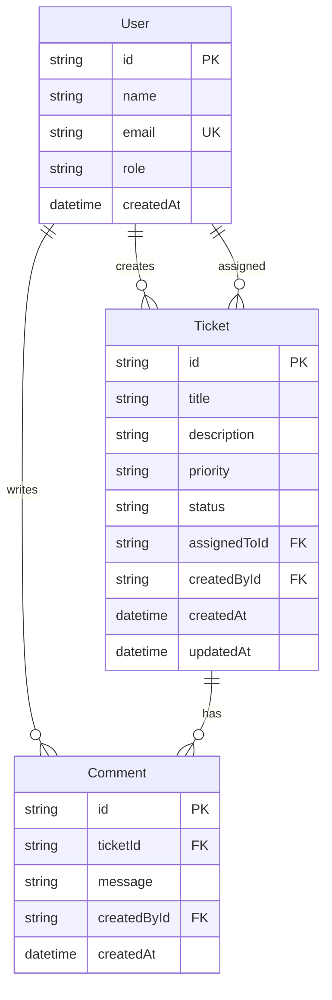

# Data Model

## Entity Relationship



## User (seeded only)

| Field | Type | Constraints |
|-------|------|-------------|
| id | TEXT | PK, UUID |
| name | TEXT | NOT NULL |
| email | TEXT | NOT NULL, UNIQUE |
| role | TEXT | AGENT or ADMIN |
| createdAt | TEXT | ISO datetime |

## Ticket

| Field | Type | Constraints |
|-------|------|-------------|
| id | TEXT | PK, UUID |
| title | TEXT | NOT NULL |
| description | TEXT | NOT NULL |
| priority | TEXT | LOW, MEDIUM, HIGH |
| status | TEXT | OPEN (default), IN_PROGRESS, RESOLVED, CLOSED, CANCELLED |
| assignedToId | TEXT | FK → User, nullable |
| createdById | TEXT | FK → User, NOT NULL |
| createdAt | TEXT | ISO datetime |
| updatedAt | TEXT | ISO datetime |

## Comment

| Field | Type | Constraints |
|-------|------|-------------|
| id | TEXT | PK, UUID |
| ticketId | TEXT | FK → Ticket, CASCADE DELETE |
| message | TEXT | NOT NULL |
| createdById | TEXT | FK → User, NOT NULL |
| createdAt | TEXT | ISO datetime |

## Status State Machine

```
OPEN        → IN_PROGRESS, CANCELLED
IN_PROGRESS → RESOLVED, CANCELLED
RESOLVED    → CLOSED
CLOSED      → (terminal)
CANCELLED   → (terminal)
```
