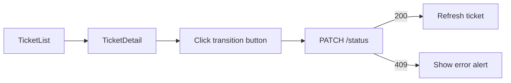

# UI Flow

## Ticket List (`/`)

1. User lands on ticket list page
2. Sees table: title, priority, status, assignee, updated date
3. Can type in search box (debounced 300ms) to filter by keyword
4. Can select status filter dropdown
5. Clicks ticket title → navigates to detail
6. Clicks "New Ticket" → navigates to create form

## Create Ticket (`/tickets/new`)

1. User fills title, description, priority
2. Selects created-by user and optional assignee from dropdowns
3. Submits form
4. On success → redirects to ticket detail
5. On validation error → shows error alert with field details

## Ticket Detail (`/tickets/:id`)

1. User sees ticket title, priority badge, status badge
2. Left panel: edit form (title, description, priority, assignee)
3. Right panel top: status transition buttons (only valid next states shown)
4. Right panel bottom: comment list + add comment form
5. Invalid status transition → error alert with API message
6. "Back to list" link returns to `/`

## Status Transition Flow

## Error States

- Loading: "Loading tickets..." / "Loading ticket..."
- Empty list: "No tickets found."
- API error: red ErrorAlert with message and optional field details
- No comments: "No comments yet."
- Terminal status: "No further status transitions available."
